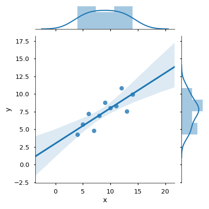
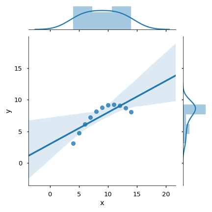
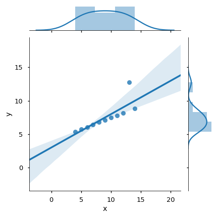
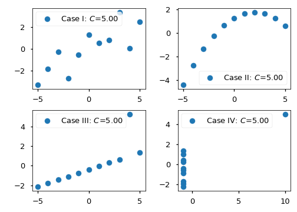
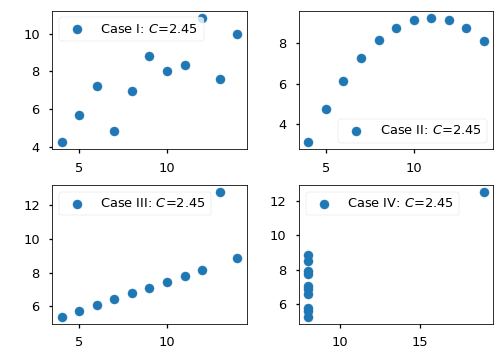
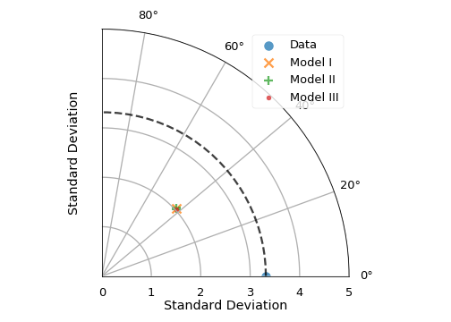

# Variation of Information

My projects involve trying to compare the outputs of different climate models. There are currently more than 20+ climate models from different companies and each of them try to produce the most accurate prediction of some physical phenomena, e.g. Sea Surface Temperature, Mean Sea Level Pressure, etc. However, it's a difficult task to provide accurate comparison techniques for each of the models. There exist some methods such as the mean and standard deviation. There is also a very common framework of visually summarizing this information in the form of Taylor Diagrams. However, the drawback of using these methods is that they are typically non-linear methods and they cannot handle multidimensional, multivariate data. 

Another way to measure similarity would be in the family of Information Theory Measures (ITMs). Instead of directly measuring first-order output statistics, these methods summarize the information via a probability distribution function (PDF) of the dataset. These can measure non-linear relationships and are naturally multivariate that offers solutions to the shortcomings of the standard methods. I would like to explore this and see if this is a useful way of summarizing information.

## Example Data

We will be using Anscombe example. This is a dataset that has the same attributes statistically, but measures like mean, variance and correlation seem to be the same. A classic dataset to show that linear methods will fail for nonlinear datasets.

<!-- 
 
  
  
  

 -->

|                                   |                                    |                                     |
| --------------------------------- | ---------------------------------- | ----------------------------------- |
|  |  |  |
| Case I                            | Case II                            | Case III                            |

**Caption**: (a) Obviously linear dataset with noise, (b) Nonlinear dataset, (c) linear dataset with an outlier.

---

## Standard Methods

There are a few important quantities to consider when we need to represent the statistics and compare two datasets. 

* Covariance
* Correlation
* Root Mean Squared

### Covariance

The covariance is a measure to determine how much two variances change. The covariance between X and Y is given by:

$$
C(X,Y)=\frac{1}{N}\sum_{i=1}^N (x_i - \mu_x)(y_i - \mu_i)
$$

where $N$ is the number of elements in both datasets. Notice how this formula assumes that the number of samples for X and Y are equivalent. This measure is unbounded as it can have a value between $-\infty$ and $\infty$. Let's look at an example of how to calculate this below.

We can remove the loop by doing a matrix multiplication.

$$
C(X,Y)=\frac{1}{N} (X-X_\mu)^\top (Y-Y_\mu)
$$

where $X,Y \in \mathbb{R}^{N\times 1}$

#### Example

If we calculate the covariance for the sample dataset, we get the following:

As you can see, we have the same statistics.

---

#### Example

An easier number to interpret. But it will not distinguish the datasets.

---

#### Example

---

## Information Theory

In this section, I will be doing the same thing as before except this time I will use the equivalent Information Theory Measures. In principle, they should be better at capturing non-linear relationships and I will be able to add different representations using spatial-temporal information.

---

### Entropy

This is the simplest and it is analogous to the standard deviation $\sigma$. Entropy is defined by

$$H(X) = - \int_{X} f(x) \log f(x) dx$$

This is the expected amount of uncertainty present in a given distributin function $f(X)$. It captures the amount of surprise within a distribution. So if there are a large number of low probability events, then the expected uncertainty will be higher. Whereas distributions with fairly equally likely events will have low entropy values as there are not many surprise events, e.g. Uniform.

---

### Mutual Information

Given two distributions X and Y, we can calculate the mutual information as

$$I(X,Y) = \int_X\int_Y p(x,y) \log \frac{p(x,y)}{p_x(x)p_y(y)}dxdy$$

where $p(x,y)$ is the joint probability and $p_x(x), p_y(y)$ are the marginal probabilities of $X$ and $Y$ respectively. We can also express the mutual information as a function of the Entropy $H(X)$

$$I(X,Y)=H(X) + H(Y) - H(X,Y)$$

#### Example

Now we finally see some differences between the distributions. 

---

#### Normalized Mutual Information

The MI measure is useful but it can also be somewhat difficult to interpret. The value goes off to $\infty$ and that value doesn't really have meaning unless we consider the entropy of the distributions from which this measure was calculated from. There are a few variants which I will list below.

**Pearson**

The measure that is closest to the Pearson correlation coefficient (thus Shannon's entropy is close to the standard variance estimate) can be defined by:

$$\text{NMI}(X,Y) = \frac{I(X,Y)}{\sqrt{H(X)H(Y)}}$$

This method acts as a pure normalization.

**Note**: one thing that strikes me as a flaw is the idea that we can get negative entropy values for differential entropy. This may cause problems if the entropy measures have opposite signs.

This is definitely much easier to interpret. The relative values are also the same.

**Redundancy**

This is a symmetric version of the normalized MI measure.

$$R=2\frac{I(X,Y)}{H(X) + H(Y)}$$

Interestingly, the relative magnitudes are not as similar anymore.

---

### Variation of Information

This quantity is akin to the RMSE for the standard statistics.
$$
\begin{aligned}
VI(X,Y) &= H(X) + H(Y) - 2I(X,Y) \\
&= I(X,X) + I(Y,Y) - 2I(X,Y)
\end{aligned}$$

This is a metric that satisfies the properties such as 
* non-negativity
* symmetry
* Triangle Inequality. 

And because the properties are satisfied, we can use it in the Taylor Diagram scheme.

I'm not sure how to interpret this...

### RVI-Based Diagram

Analagous to the Taylor Diagram, we can summarize the ITMs in a way that was easy to interpret. It used the relationship between the entropy, the mutual information and the normalized mutual information via the triangle inequality. Assuming we can draw a diagram using the law of cosines;

$$c^2 = a^2 + b^2 - 2ab \cos \phi$$

we can write this in terms of $\sigma$, $\rho$ and $RMSE$ as we have expressed above.

$$\begin{aligned}
\text{RVI}^2 &= H(X) + H(Y) - 2 \sqrt{H(X)H(Y)} \frac{I(X,Y)}{\sqrt{H(X)H(Y)}} \\
&= H(X) + H(Y) - 2 \sqrt{H(X)H(Y)} \rho
\end{aligned}$$

where The sides are as follows:

* $a = \sigma_{\text{obs}}$ - the entropy of the observed data
* $b = \sigma_{\text{sim}}$ - the entropy of the simulated data
* $\rho = \frac{I(X,Y)}{\sqrt{H(X)H(Y)}}$ - the normalized mutual information
* $RMSE$ - the variation of information between the two datasets

So, the important quantities needed to be able to plot points on the Taylor diagram are the $\sigma$ and $\theta= \arccos \rho$. If we assume that the observed data is given by $\sigma_{\text{obs}}, \theta=0$, then we can plot the rest of the comparisons via $\sigma_{\text{sim}}, \theta=\arccos \rho$.

#### Example

The nice thing is that the relative magnitudes are preserved and it definitely captures the correlations. I just need to figure out the labels of the chart...

|                                    |                                |
| ---------------------------------- | ------------------------------ |
|  |  |
| Case I: Linear Methods             | Case II: Information Theoretic |

Relative comaprison.

### VI-Based Diagram

This method uses the actual entropy measure instead of the square root.

$$\begin{aligned}
\text{RVI}^2 &= H(X)^2 + H(Y)^2 - 2 H(X)H(Y) \left( 2 I(X,Y)\frac{H(X,Y)}{H(X)H(Y)} - 1 \right) \\
&= H(X) + H(Y) - 2 H(X)H(Y) c_{XY}
\end{aligned}$$

So, the important quantities needed to be able to plot points on the Taylor diagram are the $\sigma$ and $\theta= \arccos c_{XY}$. If we assume that the observed data is given by $\sigma_{\text{obs}}, \theta=0$, then we can plot the rest of the comparisons via $\sigma_{\text{sim}}, \theta=\arccos c_{XY}$.

**Note**: 

This eliminates the sign problem. However, I wonder if this measure is actually bounded between 0 and 1. In my preliminary experiments, I had this problem. I was unable to plot this because of values obtained from the $c_{XY}$. They were not between 0 and 1 so the `arccos` function doesn't work for values outside of that range.

---

## Resources

* Comparing Clusterings by the Variation of Information - Meila (2003) - [PDF](https://link.springer.com/chapter/10.1007/978-3-540-45167-9_14)
* Comparing Clusterings - An Information Based Distance - Meila (2007) - [PDF](https://www.sciencedirect.com/science/article/pii/S0047259X06002016)
  > Paper discussing the variation of information as a distance measure from a clustering perspective. Does all of the proofs that it is a legit distance measure.
* The Mutual Information Diagram for Uncertainty Visualization - Correa & Lindstrom (2012) - [PDF](https://pdfs.semanticscholar.org/6444/05ea4cd033f138154296e58f614a8cd0dbe1.pdf) | [Prezi](https://www.sci.utah.edu/uncertainty2011/presentations/8_Correa-MutualInformationDiagram.pdf)
  > The VI measure in a Taylor diagram format. Uses the variation of information in addition to the slightly modified version.