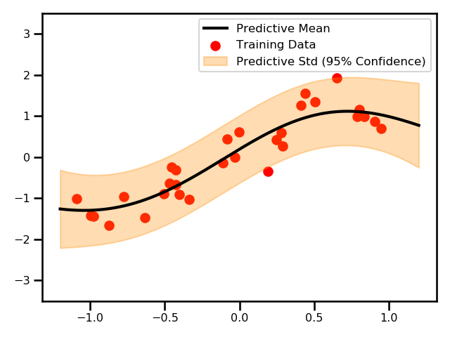
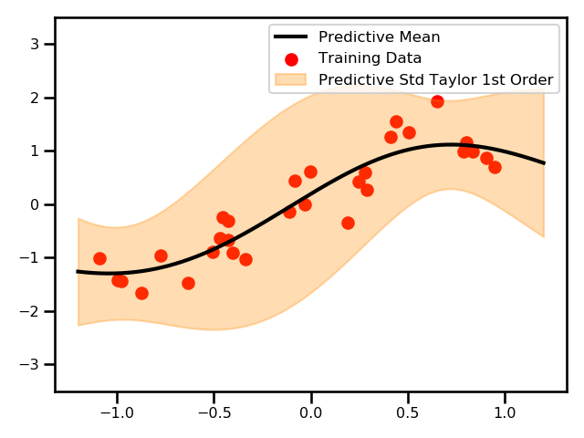
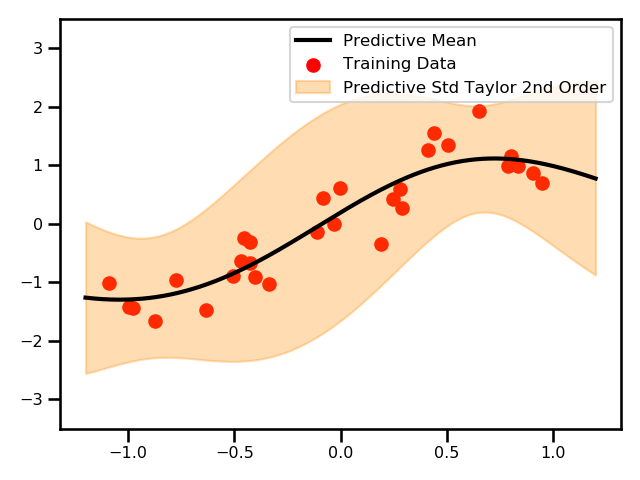
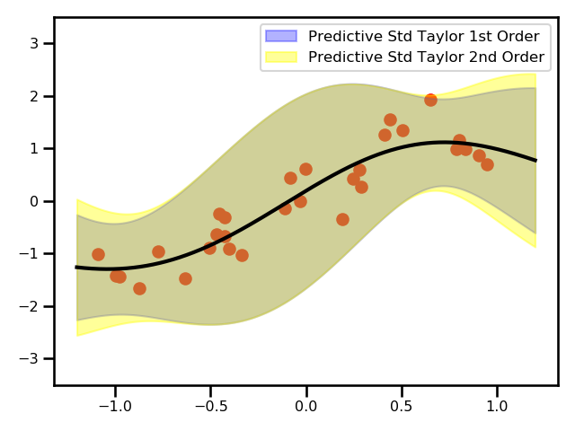
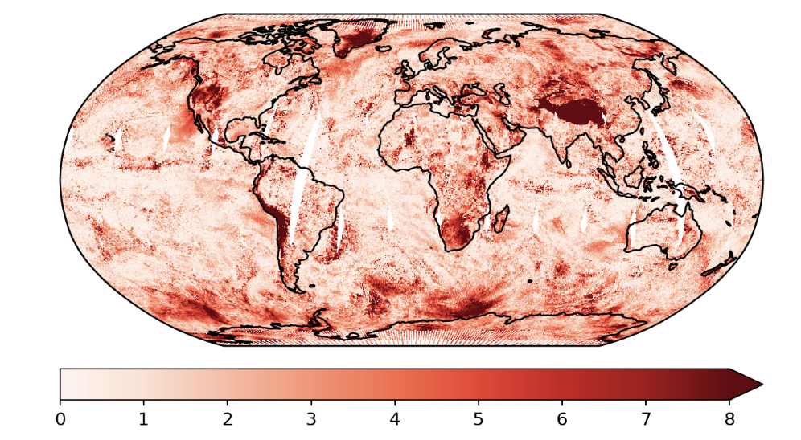
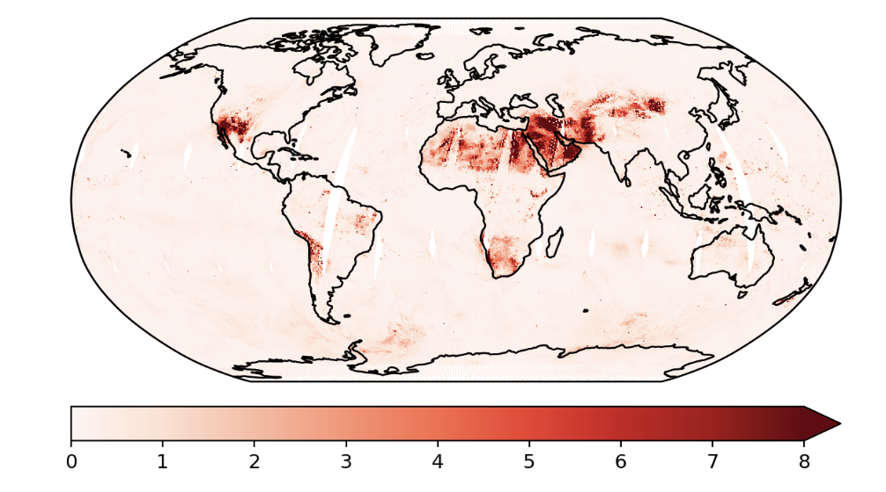
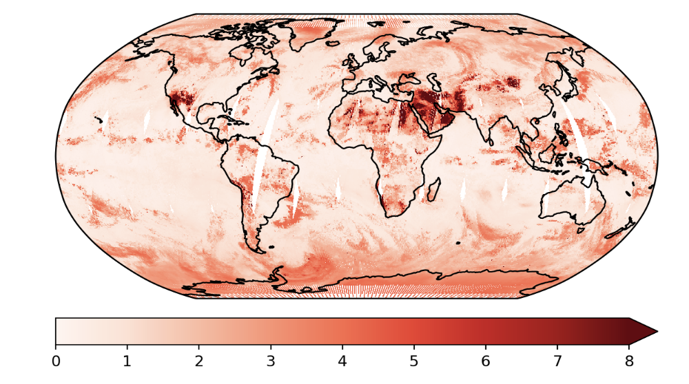

# Linearized GP

Recall the GP formulation:

$$
y=f(\mathbf{x}) + \epsilon_y, \epsilon_y \sim \mathcal{N}(0, \sigma_y^2\mathbf{I})
$$

Recall the posterior formulas:

$$\mu_\mathcal{GP}(\mathbf{x}_*) = {\bf k}_* ({\bf K}+\lambda {\bf I}_N)^{-1}{\bf y} = {\bf k}_* \alpha$$

$$\sigma_{GP*}^2 =  \sigma_y^2 + k_{**}- {\bf k}_* ({\bf K}+\sigma_y^2 \mathbf{I}_N )^{-1} {\bf k}_{*}^{\top}$$

In the case where we have uncertain inputs $\mathbf{x} \sim \mathcal{N}(\mu_\mathbf{x}, \Sigma_\mathbf{x})$, this function needs to be modified in order to accommodate the uncertainty

The posterior of this distribution is non-Gaussian because we have to propagate a probability distribution through a non-linear kernel function. So this integral becomes intractable. We can compute the analytical Gaussian approximation by only computing the mean and the variance of the posterior distribution wrt the inputs.

---

=== "Mean Function"

    $$
    \begin{aligned}
    m(\mu_\mathbf{x}, \Sigma_\mathbf{x})
    &=
    \mathbb{E}_\mathbf{f_*}
    \left[ f_* \, \mathbb{E}_\mathbf{x_*} \left[ p(f_*|\mathbf{x}_*) \right] \right] \\
    &=
    \mathbb{E}_\mathbf{x_*}
    \left[ \mathbb{E}_{f_*} \left[ f_* \,p(f_* | \mathbf{x_*}) \right]\right]\\
    &=
    \mathbb{E}_{x_*}\left[ \mu_\text{GP}(\mathbf{x_*}) \right]
    \end{aligned}
    $$

=== "Variance Function"

    The variance term is a bit more complex.

    $$
    \begin{aligned}
    v(\mu_\mathbf{x}, \Sigma_\mathbf{x})
    &=
    \mathbb{E}_\mathbf{f_*}
    \left[ f_*^2 \, \mathbb{E}_\mathbf{x_*} \left[ p(f_*|\mathbf{x}_*) \right] \right] -
    \left(\mathbb{E}_\mathbf{f_*}
    \left[ f_* \, \mathbb{E}_\mathbf{x_*} \left[ p(f_*|\mathbf{x}_*) \right] \right]\right)^2\\
    &=
    \mathbb{E}_\mathbf{x_*}
    \left[ \mathbb{E}_\mathbf{x_*} \left[ f_*^2 \, p(f_*|\mathbf{x}_*) \right] \right] -
    \left(\mathbb{E}_\mathbf{x_*}
    \left[ \mathbb{E}_\mathbf{x_*} \left[ f_* \, p(f_*|\mathbf{x}_*) \right] \right]\right)^2\\
    &=
    \mathbb{E}_\mathbf{x_*}
    \left[  \sigma_\text{GP}^2(\mathbf{x}_*) + \mu_\text{GP}^2(\mathbf{x}_*) \right] -
    \mathbb{E}_{x_*}\left[ \mu_\text{GP}(\mathbf{x_*}) \right]^2 \\
    &=
    \mathbb{E}_\mathbf{x_*}
    \left[  \sigma_\text{GP}^2(\mathbf{x}_*) \right] + \mathbb{E}_\mathbf{x_*} \left[ \mu_\text{GP}^2(\mathbf{x}_*) \right] -
    \mathbb{E}_{x_*}\left[ \mu_\text{GP}(\mathbf{x_*}) \right]^2\\
    &=
    \mathbb{E}_\mathbf{x_*} \left[  \sigma_\text{GP}^2(\mathbf{x}_*) \right] +
    \mathbb{V}_\mathbf{x_*} \left[\mu_\text{GP}(\mathbf{x}_*) \right]
    \end{aligned}
    $$

---

## Taylor Approximation

Taking complete expectations can be very expensive because we need to take the expectation wrt to the inputs through nonlinear terms such as the kernel functions and their inverses. So, we will approximate our mean and variance function via a Taylor Expansion. First the mean function:

$$
\begin{aligned}
\mathbf{z}_\mu =
\mu_\text{GP}(\mathbf{x_*})=
\mu_\text{GP}(\mu_\mathbf{x_*}) +
\nabla \mu_\text{GP}\bigg\vert_{\mathbf{x}_* = \mu_\mathbf{x}}
(\mathbf{x}_* - \mu_\mathbf{x_*})
+ \mathcal{O} (\mathbf{x_*}^2)
\end{aligned}
$$

and then the variance function:

$$
\begin{aligned}
\mathbf{z}_\sigma =
\sigma^2_\text{GP}(\mathbf{x_*})=
\sigma^2_\text{GP}(\mu_\mathbf{x_*}) +
\nabla \sigma^2_\text{GP}\bigg\vert_{\mathbf{x}_* = \mu_\mathbf{x}}
(\mathbf{x}_* - \mu_\mathbf{x_*})
+ \mathcal{O} (\mathbf{x_*}^2)
\end{aligned}
$$

!!! note "Note"
    To see more about error propagation and the relation to the mean and variance, see [here](./error_propagation.md).

So expanding these equations gives us the following:

$$
\begin{aligned}
m(\mu_\mathbf{x_*}, \Sigma_\mathbf{x_*})
&=
\mu_\text{GP}(\mu_\mathbf{x_*})\\
v(\mu_\mathbf{x_*}, \Sigma_\mathbf{x_*})
&= \sigma^2_\text{GP}(\mu_{x_*}) +
\nabla_{\mu_{GP_*}}  \mu_\text{GP}(\mu_{x_*})^\top
\Sigma_{x_*}
\nabla_{\mu_{GP_*}} \mu_\text{GP}(\mu_{x_*}) +
\frac{1}{2} \text{Tr}\left\{ \frac{\partial^2 \nu^2(\mu_{x_*})}{\partial x_* \partial x_*^\top}  \Sigma_{x_*}\right\}
\end{aligned}
$$

where $\nabla_x$ is the gradient of the function $f(\mu_x)$ w.r.t. $x$ and $\nabla_x^2 f(\mu_x)$ is the second derivative (the Hessian) of the function $f(\mu_x)$ w.r.t. $x$. This is a second-order approximation which has that expensive Hessian term. There have have been studies that have shown that that term tends to be neglible in practice and a first-order approximation is typically enough. 

Practically speaking, this leaves us with the following predictive mean and variance functions:

$$
\begin{aligned}
\mu_\text{eGP}(\mathbf{x_*}) &= k(\mathbf{x_*}) \, \mathbf{K}_{GP}^{-1}y=k(\mathbf{x_*}) \, \alpha  \\
\sigma_{eGP}^2(\mathbf{x_*}) &= \sigma_y^2 + k_{**}- {\bf k}_* ({\bf K}+\sigma_y^2 \mathbf{I}_N )^{-1} {\bf k}_{*}^{\top} + 
{\color{red}{\nabla_{\mu_{GP_*}}\Sigma_x\nabla_{\mu_{GP_*}}^\top} +
\text{Tr} \left\{  
  \frac{\partial^2 \sigma^2_{GP*}(\mathbf{x_*})}{\partial\mathbf{x_*}\partial\mathbf{x_*}^\top} \bigg\vert_{\mathbf{x_*}=\mu_{\mathbf{x_*}}} \Sigma_\mathbf{x_*}
\right\}}
\end{aligned}
$$

As seen above, the only extra term we need to include is the derivative of the mean function that is present in the predictive variance term.

## Examples

!!! details "1D Demo"

    === "Exact GP"

        

        

        

    === "1st Order Taylor"

        

        

        

        $$
        \nu_{eGP*}^2 =  
        \nu_{GP*}^2(\mathbf{x}_*)  +
        {\color{red}{\nabla_{\mu_*}\Sigma_x\nabla_{\mu_*}^\top}}
        $$

    === "2nd Order Taylor"

        

        

        

        $$
        \nu_{eGP*}^2 =  
        \nu_{GP*}^2(\mathbf{x}_*)  +
        {\color{red}{\nabla_{\mu_*}\Sigma_x\nabla_{\mu_*}^\top} +
        \text{Tr} \left\{  
          \frac{\partial^2 \nu^2_{GP*}(\mathbf{x_*})}{\partial\mathbf{x_*}\partial\mathbf{x_*}^\top} \bigg\vert_{\mathbf{x_*}=\mu_{\mathbf{x_*}}} \Sigma_\mathbf{x_*}
        \right\}}
        $$

    === "Differences"

        

        

        

        Here, we see a plot for the differences between the two GPs.

!!! details "Satellite Data"

    === "Absolute Error"

        

    === "Exact GP"

        

        These are the predictions using the exact GP and the predictive variances.

    === "Linearized GP"

        

        This is an example where we used the Taylor expanded GP. In this example, we only did the first order approximation.

---

## Sparse GPs

We can extend this method to other GP algorithms including sparse GP models. The only thing that changes are the original $\mu_{GP}$ and $\nu^2_{GP}$ equations. In a sparse GP we have the following predictive functions

$$
\begin{aligned}
    \mu_{SGP} &= K_{*z}K_{zz}^{-1}m \\
    \nu^2_{SGP} &= K_{**} 
    - K_{*z}\left[ K_{zz}^{-1} - K_{zz}^{-1}SK_{zz}^{-1} \right]K_{*z}^{\top}
\end{aligned}
$$

So the new predictive functions will be:

$$
\begin{aligned}
    \mu_{SGP} &= K_{*z}K_{zz}^{-1}m \\
    \nu^2_{SGP} &= K_{**} 
    - K_{*z}\left[ K_{zz}^{-1} - K_{zz}^{-1}SK_{zz}^{-1} \right]K_{*z}^{\top} 
    + \tilde{\Sigma}_x
\end{aligned}
$$

Practically speaking, this leaves us with the following predictive mean and variance functions:

$$
\begin{aligned}
\mu_\text{eSGP}(\mathbf{x_*}) &= k(\mathbf{x_*}) \, \mathbf{K}_{GP}^{-1}y=k(\mathbf{x_*}) \, \alpha  \\
\sigma_{eSGP}^2(\mathbf{x_*}) &=
\sigma_y^2 + 
K_{**} - K_{*z}\left[ K_{zz}^{-1} - K_{zz}^{-1}SK_{zz}^{-1} \right]K_{*z}^{\top}  + {\color{red}{\nabla_{\mu_{SGP_*}}\Sigma_x\nabla_{\mu_{SGP_*}}^\top} +
\text{Tr} \left\{  
  \frac{\partial^2 \sigma^2_{SGP*}(\mathbf{x_*})}{\partial\mathbf{x_*}\partial\mathbf{x_*}^\top} \bigg\vert_{\mathbf{x_*}=\mu_{\mathbf{x_*}}} \Sigma_\mathbf{x_*}
\right\}}
\end{aligned}
$$

As shown above, this is a fairly extensible method that offers a cheap improved predictive variance estimates on an already trained GP model. Some future work could be evaluating how other GP models, e.g. Sparse Spectrum GP, Multi-Output GPs, e.t.c.

---

## Literature

**Theory**

* Bayesian Filtering and Smoothing - Smio Sarkka ()- Book
* Modelling and Control of Dynamic Systems Using GP Models - Jus Kocijan () - Book

**Applied to Gaussian Processes**

* Gaussian Process Priors with Uncertain Inputs: Multiple-Step-Ahead Prediction - Girard et. al. (2002) - Technical Report
  > Does the derivation for taking the expectation and variance for the  Taylor series expansion of the predictive mean and variance. 
* Expectation Propagation in Gaussian Process Dynamical Systems: Extended Version - Deisenroth & Mohamed (2012) - NeuRIPS
  > First time the moment matching **and** linearized version appears in the GP literature.
* Learning with Uncertainty-Gaussian Processes and Relevance Vector Machines - Candela (2004) - Thesis
  > Full law of iterated expectations and conditional variance.
* Gaussian Process Training with Input Noise - McHutchon & Rasmussen et. al. (2012) - NeuRIPS 
  > Used the same logic but instead of just approximated the posterior, they also applied this to the model which resulted in an iterative procedure.
* Multi-class Gaussian Process Classification with Noisy Inputs - Villacampa-Calvo et. al. (2020) - [axriv]()
  > Applied the first order approximation using the Taylor expansion for a classification problem. Compared this to the variational inference.
